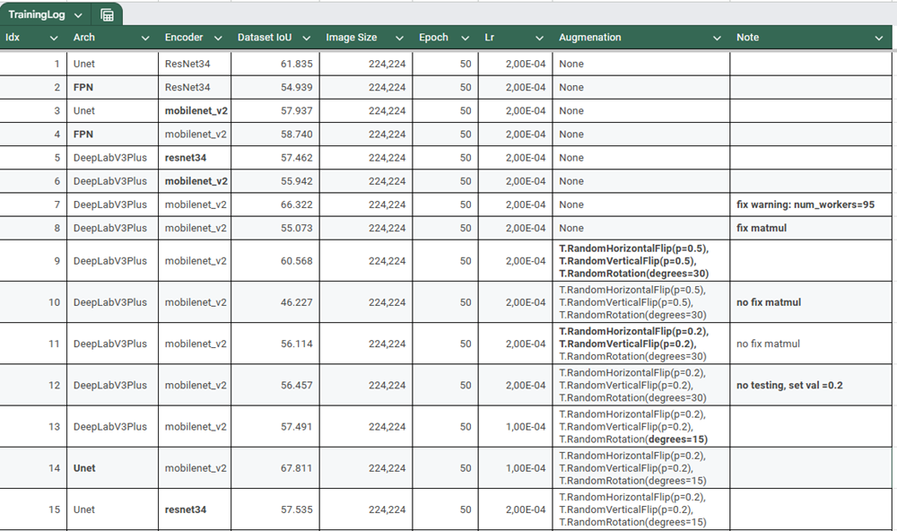
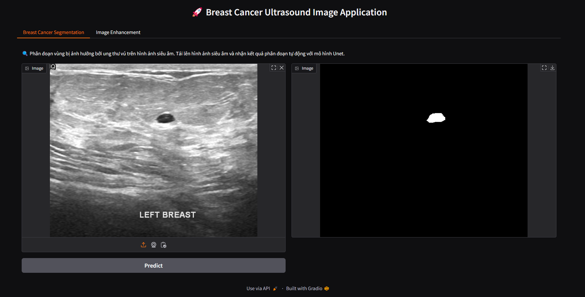

## 🎗️ BREAST CANCER DETECTION APPLICATION
### 📜Description:
Breast cancer is the leading cause of cancer deaths in women (Highest incidence rate of cancer).
Breast ultrasound imaging is noninvasive, nonradioactive, and cost-effective. 
Besides previous studies using x-rays to diagnose cancer mammograms, breast ultrasound diagnosis achieves promising abilities overall.
### 📊 Dataset:
- The dataset consists of the medical images of breast cancer using ultrasound scan, which is categorized into three classes: normal, benign, and malignant images.
Breast ultrasound images can produce great results in classification, detection, and segmentation of breast cancer when combined with machine learning.
- Access: [Dataset Link](https://scholar.cu.edu.eg/?q=afahmy/pages/dataset) 🌐
- At the beginning, the number of images collected was 1100. After performing preprocessing to the dataset, the number of images was reduced to 780 images.
LOGIQ E9 ultrasound system and LOGIQ E9 Agile ultrasound system produce image resolution of 1280×1024. All images were cropped. The average image size of 500×500 pixels.

### ⚙️ Model: 
This respository support for training many architecture such as Unet, Unet++, DeepLabv3, DeepLabv3Plus,... and Encoder such as EfficientNet, ResNet,... using [PytorchLightning](https://lightning.ai/docs/pytorch/stable/), [Pytorch Segmentation Models](https://github.com/qubvel-org/segmentation_models.pytorch) Libraries.


### 🧪 Experiments:
These model with many encoders were trained augmentation **flip** and **rotation**, **test_size**=0.2 🔄



### 🔧 Installation:
`pip install -r requirements.txt`
### 🚀 Usage:
- **Inference**:
```
conda activate env
cd src/
python run_infer.py arg1 arg2 arg3
```
- **Train**:
```
cd src/
python run_train.py arg1 arg2 arg3
```
- **Run Application**: <br>
This app designed with 2 main functions: **Image segmentation** and **apply CLAHE for purpose of supporting doctor**.<br>
```
python main.py
```

